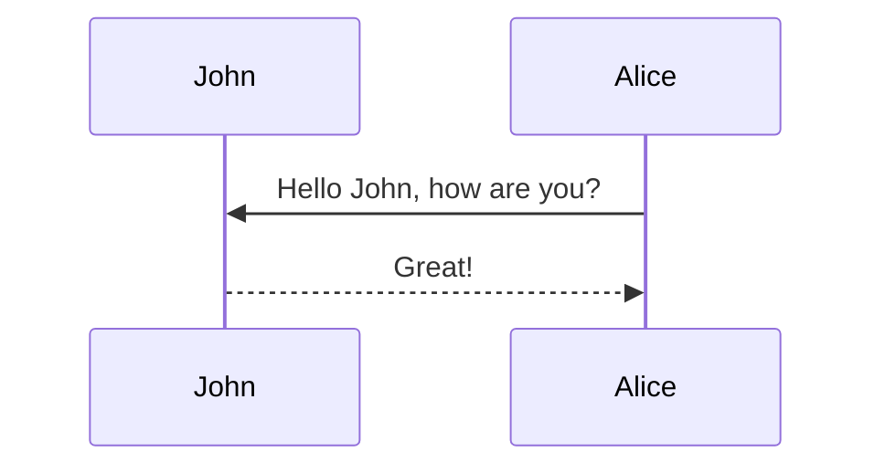

This is how a post with [tabs](https://github.com/Ovski4/jekyll-tabs) looks like. Note that the tabs could be used for different purposes, not only for code.

## First tabs
With this you can generate visualizations like:





```php
var_dump('hello');
```





```javascript
console.log("hello");
```





```javascript
pputs 'hello'
```






```pseudocode
% This quicksort algorithm is extracted from Chapter 7, Introduction to Algorithms (3rd edition)
\begin{algorithm}
\caption{Quicksort}
\begin{algorithmic}
\PROCEDURE{Quicksort}{$$A, p, r$$}
    \IF{$$p < r$$}
        \STATE $$q = $$ \CALL{Partition}{$$A, p, r$$}
        \STATE \CALL{Quicksort}{$$A, p, q - 1$$}
        \STATE \CALL{Quicksort}{$$A, q + 1, r$$}
    \ENDIF
\ENDPROCEDURE
\PROCEDURE{Partition}{$$A, p, r$$}
    \STATE $$x = A[r]$$
    \STATE $$i = p - 1$$
    \FOR{$$j = p$$ \TO $$r - 1$$}
        \IF{$$A[j] < x$$}
            \STATE $$i = i + 1$$
            \STATE exchange
            $$A[i]$$ with $$A[j]$$
        \ENDIF
        \STATE exchange $$A[i]$$ with $$A[r]$$
    \ENDFOR
\ENDPROCEDURE
\end{algorithmic}
\end{algorithm}
```

Which generates:

```vega_lite
{
  "$schema": "https://vega.github.io/schema/vega-lite/v5.json",
  "description": "A dot plot showing each movie in the database, and the difference from the average movie rating. The display is sorted by year to visualize everything in sequential order. The graph is for all Movies before 2019.",
  "data": {
    "url": "https://raw.githubusercontent.com/vega/vega/main/docs/data/movies.json"
  },
  "transform": [
    {"filter": "datum['IMDB Rating'] != null"},
    {"filter": {"timeUnit": "year", "field": "Release Date", "range": [null, 2019]}},
    {
      "joinaggregate": [{
        "op": "mean",
        "field": "IMDB Rating",
        "as": "AverageRating"
      }]
    },
    {
      "calculate": "datum['IMDB Rating'] - datum.AverageRating",
      "as": "RatingDelta"
    }
  ],
  "mark": "point",
  "encoding": {
    "x": {
      "field": "Release Date",
      "type": "temporal"
    },
    "y": {
      "field": "RatingDelta",
      "type": "quantitative",
      "title": "Rating Delta"
    },
    "color": {
      "field": "RatingDelta",
      "type": "quantitative",
      "scale": {"domainMid": 0},
      "title": "Rating Delta"
    }
  }
}
```

This plot supports both light and dark themes.

This is an example post with advanced image components.

## Image Slider

This is a simple image slider. It uses the [Swiper](https://swiperjs.com/) library. Check the [examples page](https://swiperjs.com/demos) for more information of what you can achieve with it.

<swiper-container keyboard="true" navigation="true" pagination="true" pagination-clickable="true" pagination-dynamic-bullets="true" rewind="true">
  <swiper-slide></swiper-slide>
  <swiper-slide></swiper-slide>
  <swiper-slide></swiper-slide>
  <swiper-slide></swiper-slide>
  <swiper-slide></swiper-slide>
</swiper-container>

## Image Comparison Slider

This is a simple image comparison slider. It uses the [img-comparison-slider](https://img-comparison-slider.sneas.io/) library. Check the [examples page](https://img-comparison-slider.sneas.io/examples.html) for more information of what you can achieve with it.


  
  
</img-comparison-slider>

Which generates:

```geojson
{
  "type": "FeatureCollection",
  "features": [
    {
      "type": "Feature",
      "properties": {},
      "geometry": {
        "coordinates": [
          [
            [
              -60.11363029935569,
              -2.904625022183211
            ],
            [
              -60.11363029935569,
              -3.162613728707967
            ],
            [
              -59.820894493858034,
              -3.162613728707967
            ],
            [
              -59.820894493858034,
              -2.904625022183211
            ],
            [
              -60.11363029935569,
              -2.904625022183211
            ]
          ]
        ],
        "type": "Polygon"
      }
    }
  ]
}
```

Which generates:

```echarts
{
  "title": {
    "text": "ECharts Getting Started Example"
  },
  "responsive": true,
  "tooltip": {},
  "legend": {
    "top": "30px",
    "data": ["sales"]
  },
  "xAxis": {
    "data": ["Shirts", "Cardigans", "Chiffons", "Pants", "Heels", "Socks"]
  },
  "yAxis": {},
  "series": [
    {
      "name": "sales",
      "type": "bar",
      "data": [5, 20, 36, 10, 10, 20]
    }
  ]
}
```

Note that this library offer support for both light and dark themes. You can switch between them using the theme switcher in the top right corner of the page.

This is how it looks like:

```chartjs
{
  "type": "line",
  "data": {
    "labels": [
      "January",
      "February",
      "March",
      "April",
      "May",
      "June",
      "July"
    ],
    "datasets": [
      {
        "label": "# of bugs",
        "fill": false,
        "lineTension": 0.1,
        "backgroundColor": "rgba(75,192,192,0.4)",
        "borderColor": "rgba(75,192,192,1)",
        "borderCapStyle": "butt",
        "borderDash": [],
        "borderDashOffset": 0,
        "borderJoinStyle": "miter",
        "pointBorderColor": "rgba(75,192,192,1)",
        "pointBackgroundColor": "#fff",
        "pointBorderWidth": 1,
        "pointHoverRadius": 5,
        "pointHoverBackgroundColor": "rgba(75,192,192,1)",
        "pointHoverBorderColor": "rgba(220,220,220,1)",
        "pointHoverBorderWidth": 2,
        "pointRadius": 1,
        "pointHitRadius": 10,
        "data": [
          65,
          59,
          80,
          81,
          56,
          55,
          40
        ],
        "spanGaps": false
      }
    ]
  },
  "options": {}
}
```

Which generates:

```chartjs
{
  "type": "doughnut",
  "data": {
    "labels": [
      "Red",
      "Blue",
      "Yellow"
    ],
    "datasets": [
      {
        "data": [
          300,
          50,
          100
        ],
        "backgroundColor": [
          "#FF6384",
          "#36A2EB",
          "#FFCE56"
        ],
        "hoverBackgroundColor": [
          "#FF6384",
          "#36A2EB",
          "#FFCE56"
        ]
      }
    ]
  },
  "options": {}
}
```

```markdown
> ##### TIP
>
> A tip can be used when you want to give advice
> related to a certain content.
{: .block-tip }
```

> ##### TIP
>
> A tip can be used when you want to give advice
> related to a certain content.
{: .block-tip }

```markdown
> ##### WARNING
>
> This is a warning, and thus should
> be used when you want to warn the user
{: .block-warning }
```

> ##### WARNING
>
> This is a warning, and thus should
> be used when you want to warn the user
{: .block-warning }

```markdown
> ##### DANGER
>
> This is a danger zone, and thus should
> be used carefully
{: .block-danger }
```

> ##### DANGER
>
> This is a danger zone, and thus should
> be used carefully
{: .block-danger }

<!-- prettier-ignore-end -->

This post shows how to add a table of contents as a sidebar.

## Adding a Table of Contents

To add a table of contents to a post as a sidebar, simply add

```yml
toc:
  sidebar: left
```

<div class="row mt-3">
    <div class="col-sm mt-3 mt-md-0">
        
    </div>
    <div class="col-sm mt-3 mt-md-0">
        
    </div>
</div>
<div class="caption">
    A simple, elegant caption looks good between video rows, after each row, or doesn't have to be there at all.
</div>


This is an example post with videos. It supports local video files.

<div class="row mt-3">
    <div class="col-sm mt-3 mt-md-0">
        
    </div>
    <div class="col-sm mt-3 mt-md-0">
        
    </div>
</div>
<div class="caption">
    A simple, elegant caption looks good between video rows, after each row, or doesn't have to be there at all.
</div>

It does also support embedding videos from different sources. Here are some examples:

<div class="row mt-3">
    <div class="col-sm mt-3 mt-md-0">
        
    </div>
    <div class="col-sm mt-3 mt-md-0">
        
    </div>
</div>

# redirect: /assets/pdf/example_pdf.pdf
# Redirecting to another page.



This post shows how to add DISQUS comments.

This is an example post with image galleries.

<div class="row mt-3">
    <div class="col-sm mt-3 mt-md-0">
        
    </div>
    <div class="col-sm mt-3 mt-md-0">
        
    </div>
</div>
<div class="caption">
    A simple, elegant caption looks good between image rows, after each row, or doesn't have to be there at all.
</div>

Images can be made zoomable.
Simply add `data-zoomable` to `` tags that you want to make zoomable.

<div class="row mt-3">
    <div class="col-sm mt-3 mt-md-0">
        
    </div>
    <div class="col-sm mt-3 mt-md-0">
        
    </div>
</div>

The rest of the images in this post are all zoomable, arranged into different mini-galleries.

<div class="row mt-3">
    <div class="col-sm mt-3 mt-md-0">
        
    </div>
    <div class="col-sm mt-3 mt-md-0">
        
    </div>
    <div class="col-sm mt-3 mt-md-0">
        
    </div>
</div>